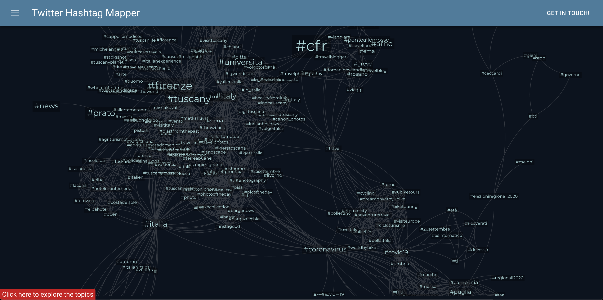

# Twitter's Hashtag Semantic Graph Mapper

A 100% unofficial tool to visualize the semantic graph of the Twitter hashtags. And mainly a good excuse to experiment with building full-stack data science products :)

Built with React + Python + Redis + Docker

## Motivation

At the beginning of a new design project, it is key to get up to speed with the topic and capture the different nuances that characterize it. One key step of this process is desk research, as it acts as the foundation to set up the following design research phase.

This tool aims at helping design teams to speed up the initial desk research phase, organizing the hashtags from Twitter in topics using community detection algorithms and thus providing a quick overview with the possibility to drill down to selected sub-topics.

## Use it

A deployed version of this app is coming soon!

## Run it locally

1. Make sure you have Docker and Docker-compose installed.
2. Obtain the `ACCESS_TOKEN_KEY`, `ACCESS_TOKEN_SECRET`, `CONSUMER_KEY`, `CONSUMER_SECRET` from Twitter and save them in the `server/env_file` file. The file should be formatted with one entry per line, encoded in this format: `ENVIRONMENTAL_VAR=ABCDEFG12345`
3. Move to the repo root directory and run `docker-compose build && docker-compose up`

This will serve the website at `localhost:3000`

## Built with

Here are the key building blocks for this app. The extensive list can be found in the source code

### Frontend

- React.js
- [React force graph](https://github.com/vasturiano/react-force-graph)
- [Material-UI](https://material-ui.com/)

### Backend

- Python 3.8
- [FastAPI](https://fastapi.tiangolo.com/)
- Redis (for caching)
